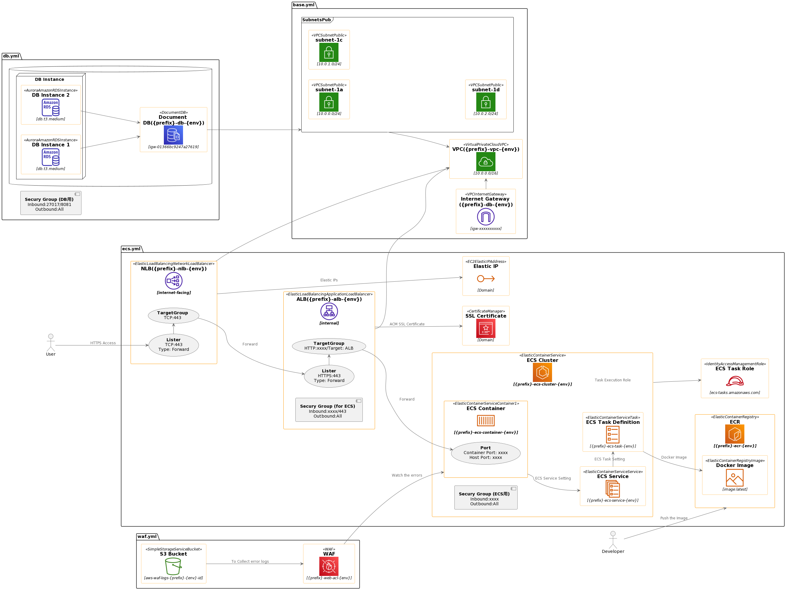

# CloudFormation Templates

- [ ] You need to import SSL Certification to ACM
- [ ] You need to have pushed a Docker image to ECR
- [ ] Your machine has to have AWS CLI installed

※ If you don't use Document DB, you can skip launching '2.db.yml' 
※ If you don't use WAF, you can skip launching '5.waf.yml'

# Usage
1. Launch '1.base.yml'
2. Launch '2.db.yml' (optional)
3. Launch '3.nlb.yml'
4. Launch '4.ecs.yml'
5. Launch '5.waf.yml'
